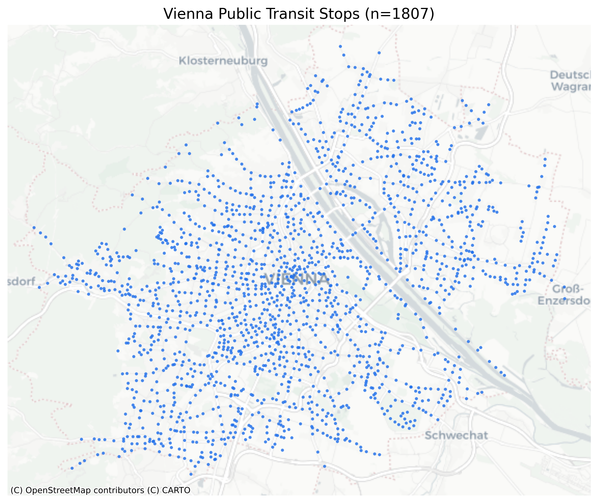

# Vienna Mobility Map

End-to-end Python pipeline pulling public transit stop locations from the City of Vienna's open [WFS API](https://data.wien.gv.at/daten/geo), rendered as an interactive geospatial visualization of mobility infrastructure across the city.



### [▶ View the interactive map](https://hiulian69.github.io/vienna-mobility-map/)

Live on GitHub Pages — every Wiener Linien stop, clickable. No install, no download.

## Data source

[Stadt Wien Open Government Data](https://digitales.wien.gv.at/open-data/), layer `ogdwien:HALTESTELLEWLOGD` ("Haltestellen Wiener Linien") — every public transit stop (tram, bus, U-Bahn) in Vienna, queried live via WFS `GetFeature`.

## Pipeline

- `src/pipeline.py`
  - `fetch_stops()` — WFS `GetFeature` request against `data.wien.gv.at`, returned as a GeoDataFrame
  - `clean_stops()` — drops null geometries/duplicates, normalizes column names
  - `build_map()` — renders stops as an interactive Folium map with popups
- `notebooks/01_vienna_mobility_pipeline.ipynb` — the same pipeline, walked through end-to-end with exploratory plots and exports

## Setup

```bash
python3 -m venv venv
source venv/bin/activate
pip install -r requirements.txt
```

## Run

```bash
python src/pipeline.py          # regenerates output/vienna_mobility_map.html
jupyter notebook notebooks/01_vienna_mobility_pipeline.ipynb
```

## Stack

Python · geopandas · folium · matplotlib/contextily · Jupyter
